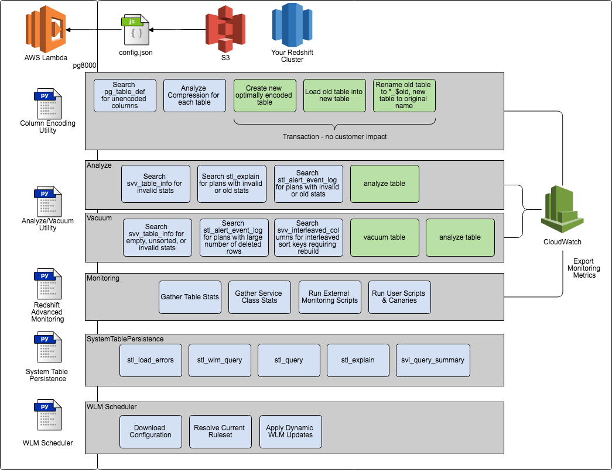
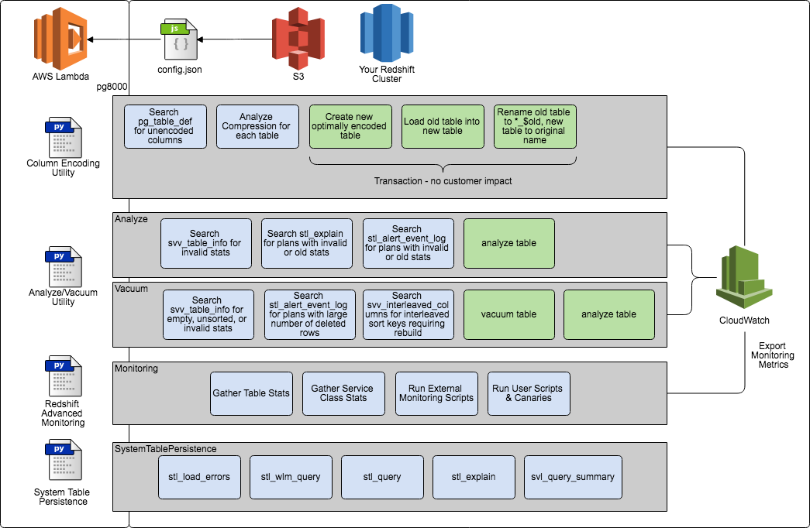
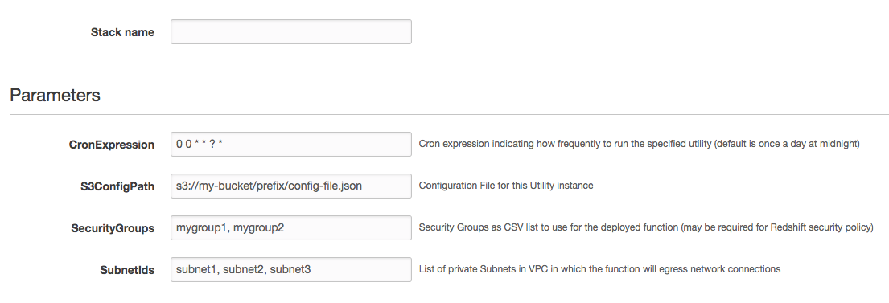

# Amazon Redshift Automation

This project includes code that is able to run several of the Amazon Redshift Utilities in AWS Lambda to automate the most common administrative tasks on a Redshift database. By using a Lambda function scheduled via a [CloudWatch Event](http://docs.aws.amazon.com/AmazonCloudWatch/latest/DeveloperGuide/WhatIsCloudWatchEvents.html), you can ensure that these valuable utilities run automatically and keep your Redshift cluster running well.



This utility creates a Lambda function which imports other Redshift Utils modules, and then invokes them against a cluster. It runs within your VPC, and should be configured to connect via a Subnet which is either the same, or can route to the subnet where your Redshift cluster is running. It should also be configured with a Security Group which is trusted by your [Redshift Cluster Security Configuration](http://docs.aws.amazon.com/redshift/latest/mgmt/working-with-security-groups.html).

Currently the [Column Encoding Utility](src/ColumnEncodingUtility), [Analyze/Vacuum Utility](src/AnalyzeVacuumUtility), [Redshift Advanced Monitoring](https://github.com/awslabs/amazon-redshift-monitoring), and [System Table Persistence](src/SystemTablePersistence) are supported for automated invocation:



## Setup Pre-Tasks

Because these utilities need to access your Redshift cluster, they require a username and password for authentication. This function reads these values from a configuration file, and expects that the database password is a base64 encoded string that has been encrypted by [AWS KMS](https://aws.amazon.com/kms). In order to authenticate when the utility is run by AWS Lambda, the IAM role granted to AWS Lambda must have rights to decrypt data using KMS, and must also include this application's internal encryption context (which you may change if you desire).

To encrypt your password for use by this function, please run the [encrypt_password.py](encrypt_password.py) script, and type your password as the first argument:

```
> export AWS_REGION=my-aws-region
> (python) encrypt_password.py MY_SECRET_PASSWORD
```

This will create the required Customer Master Key in KMS, along with a key alias that makes it easy to work with (called ```alias/RedshiftUtilsLambdaRunner```) and so must be run as a user with rights to do so. It will then encrypt the supplied password and output the encrypted ciphertext as a base64 encoded string:

```
$ ./encrypt_password.py MY_SECRET_PASSWORD
Encryption Complete
Encrypted Password: CiChAYm4goRPj1CuMlY+VbyChti8kHVW4kxInA+keC7gPxKZAQEBAgB4oQGJuIKET49QrjJWPlW8gobYvJB1VuJMSJwPpHgu4D8AAABwMG4GCSqGSIb3DQEHBqBhMF8CAQAwWgYJKoZIhvcNAQcBMB4GCWCGSAFlAwQBLjARBAwdVzuq29SCuPKlh9ACARCALY1H/Tb4Hw73yqLyL+Unjp4NC0F5UjETNUGPtM+DTHG8urILNTKvdv1t9S5zuQ==
```

Copy the value after ```Encrypted Password: ``` and use it for the creation of the config file.

## Configuration

This lambda function uses a configuration file to get information about which cluster to connect to, which utilities to run, and other information it needs to accomplish its task. An example `config-example.json` is included to get you started. You configure which utility to run in the ```'utilities'``` array - currently the values ```ColumnEncodingUtility, AnalyzeVacuumUtility``` are supported

The required configuration items are placed into the ```configuration``` part of the config file, and include:

```
{"utilities":["ColumnEncodingUtility", "AnalyzeVacuumUtility", "Monitoring"],
"configuration":{
  "table_name": "Specific table names to operate on (string)",
  "schema_name": "Schema to be analyzed, vacuumed, or encoded (string)",
  "comprows": "Rows to use in the analyze compression request (int | default -1 meaning unspecified)",
  "db": "Database Name to connect to (string)",
  "db_host": "Your cluster DNS name (string)",
  "db_password": "Your base64 encoded encrypted password here (string - generated with encrypt_password.py)",
  "db_port": "The database port number (int)",
  "db_user": "The database User to connect to (string)",
  "drop_old_data": "When column encoding is invoked, should the old database table be kept as XXX_$old? (boolean - true | false | default false)",
  "ignore_errors": "Should a given utility keep running if it encouters errors, and fail the Lambda function? (boolean - true | false | default false)",
  "query_group": "Query group name to set for routing to a specific WLM queue (string)",
  "query_slot_count": "Number of query slots to use - set to queue(max) for optimal performance (int - default 1)",
  "target_schema": "When column encoding is invoked, should it build new tables into a different schema? (string)",
  "force": "Do you want to force the utility to run for each provided table or schema, even if changes are not required? (boolean - true | false | default false)",
  "output_file":"/tmp/analyze-schema-compression.sql",
  "debug": "Should the utilities run in debug mode? (boolean - true | false | default false)",
  "do_execute": "Should changes be made automatically, or just for reporting purposes (boolean - true |  false | default true)",
  "analyze_col_width": "Analyze varchar columns wider that 255 characters and reduce size based on determined data length (boolean - default false)",
  "threads": "How many threads should the column encoding utility use (can run in parallel - default 1 for Lambda)",
  "ssl":"Should you connect to the cluster with SSL? (boolean true | false | default true)",
  "do_vacuum": "Should the Analyze Vacuum utility run Vacuum? (boolean true | false | default true)",
  "do_analyze":"Should the Analyze Vacuum utility run Analyze? (boolean true | false | default true)",
  "blacklisted_tables":"comma separated list of tables to suppress running the analyze vacuum utility against",
  "agg_interval":"Interval on which to summarise database statistics (redshift interval literal: http://docs.aws.amazon.com/redshift/latest/dg/r_interval_literals.html | default '1 hour'",
  "cluster_name":"The cluster name that is the first part of the DNS name"
  }
}
```

[](https://rawgit.com/awslabs/amazon-redshift-utils/master/src/RedshiftAutomation/ConfigurationForm.html)

Save this configuration to a json file, and place it on S3. We will refer to the file when we launch the SAM Template. Alternatively you can rebuild the project manually using filename 'config.json', and it will automatically be imported.

### Additional config options

You can also add the following configuration options to finely tune the operation of the various included utilities:

```
"analyze_col_width": "Width of varchar columns to be optimised during encoding analysis (default 1)",
"vacuum_parameter": "Vacuum type to be run, including FULL, SORT ONLY, DELETE ONLY, REINDEX (default FULL)",
"min_unsorted_pct": "Minimum unsorted percentage(%) to consider a table for vacuum (default 5%)",
"max_unsorted_pct": "Maximum unsorted percentage(%) to consider a table for vacuum (default 50%)",
"stats_off_pct": "Minimum stats off percentage(%) to consider a table for analyze (default 10%)",
"predicate_cols": "Flag to enforce only analyzing predicate columns (see http://bit.ly/2o163tC)",
"suppress_cw": "Set to true to suppress utilities exporting CloudWatch metrics",
"max_table_size_mb": "Maximum Table Size in MB for automatic re-encoding (default 700MB)",
"min_interleaved_skew": "Minimum index skew to consider a table for vacuum reindex (default 1.4)",
"min_interleaved_count": "Minimum stv_interleaved_counts records to consider a table for vacuum reindex (default 0)",
"kms_auth_context": "Authorisation context used when the db_pwd was encrypted (must be valid JSON)"
```

## Deploying

We have provided the following AWS SAM templates so that you can deploy this function automatically (please note that we currently only support deploying into VPC):

| Region | Template |
| ------ | ---------- |
|ap-northeast-1 |  [](https://console.aws.amazon.com/cloudformation/home?region=ap-northeast-1#/stacks/new?stackName=RedshiftAutomation&templateURL=https://s3-ap-northeast-1.amazonaws.com/awslabs-code-ap-northeast-1/LambdaRedshiftRunner/deploy.yaml) |
|ap-northeast-2 |  [](https://console.aws.amazon.com/cloudformation/home?region=ap-northeast-2#/stacks/new?stackName=RedshiftAutomation&templateURL=https://s3-ap-northeast-2.amazonaws.com/awslabs-code-ap-northeast-2/LambdaRedshiftRunner/deploy.yaml) |
|ap-south-1 |  [](https://console.aws.amazon.com/cloudformation/home?region=ap-south-1#/stacks/new?stackName=RedshiftAutomation&templateURL=https://s3-ap-south-1.amazonaws.com/awslabs-code-ap-south-1/LambdaRedshiftRunner/deploy.yaml) |
|ap-southeast-1 |  [](https://console.aws.amazon.com/cloudformation/home?region=ap-southeast-1#/stacks/new?stackName=RedshiftAutomation&templateURL=https://s3-ap-southeast-1.amazonaws.com/awslabs-code-ap-southeast-1/LambdaRedshiftRunner/deploy.yaml) |
|ap-southeast-2 |  [](https://console.aws.amazon.com/cloudformation/home?region=ap-southeast-2#/stacks/new?stackName=RedshiftAutomation&templateURL=https://s3-ap-southeast-2.amazonaws.com/awslabs-code-ap-southeast-2/LambdaRedshiftRunner/deploy.yaml) |
|ca-central-1 |  [](https://console.aws.amazon.com/cloudformation/home?region=ca-central-1#/stacks/new?stackName=RedshiftAutomation&templateURL=https://s3-ca-central-1.amazonaws.com/awslabs-code-ca-central-1/LambdaRedshiftRunner/deploy.yaml) |
|eu-central-1 |  [](https://console.aws.amazon.com/cloudformation/home?region=eu-central-1#/stacks/new?stackName=RedshiftAutomation&templateURL=https://s3-eu-central-1.amazonaws.com/awslabs-code-eu-central-1/LambdaRedshiftRunner/deploy.yaml) |
|eu-west-1 |  [](https://console.aws.amazon.com/cloudformation/home?region=eu-west-1#/stacks/new?stackName=RedshiftAutomation&templateURL=https://s3-eu-west-1.amazonaws.com/awslabs-code-eu-west-1/LambdaRedshiftRunner/deploy.yaml) |
|eu-west-2 |  [](https://console.aws.amazon.com/cloudformation/home?region=eu-west-2#/stacks/new?stackName=RedshiftAutomation&templateURL=https://s3-eu-west-2.amazonaws.com/awslabs-code-eu-west-2/LambdaRedshiftRunner/deploy.yaml) |
|sa-east-1 |  [](https://console.aws.amazon.com/cloudformation/home?region=sa-east-1#/stacks/new?stackName=RedshiftAutomation&templateURL=https://s3-sa-east-1.amazonaws.com/awslabs-code-sa-east-1/LambdaRedshiftRunner/deploy.yaml) |
|us-east-1 |  [](https://console.aws.amazon.com/cloudformation/home?region=us-east-1#/stacks/new?stackName=RedshiftAutomation&templateURL=https://s3-us-east-1.amazonaws.com/awslabs-code-us-east-1/LambdaRedshiftRunner/deploy.yaml) |
|us-east-2 |  [](https://console.aws.amazon.com/cloudformation/home?region=us-east-2#/stacks/new?stackName=RedshiftAutomation&templateURL=https://s3-us-east-2.amazonaws.com/awslabs-code-us-east-2/LambdaRedshiftRunner/deploy.yaml) |
|us-west-1 |  [](https://console.aws.amazon.com/cloudformation/home?region=us-west-1#/stacks/new?stackName=RedshiftAutomation&templateURL=https://s3-us-west-1.amazonaws.com/awslabs-code-us-west-1/LambdaRedshiftRunner/deploy.yaml) |
|us-west-2 |  [](https://console.aws.amazon.com/cloudformation/home?region=us-west-2#/stacks/new?stackName=RedshiftAutomation&templateURL=https://s3-us-west-2.amazonaws.com/awslabs-code-us-west-2/LambdaRedshiftRunner/deploy.yaml) |

Alternatively, you can manually upload the template from the `dist` directory. There are also separate templates to [just deploy a single utility](deploy-function-and-schedule.yaml) or just [create a scheduled event for an existing function](deploy-schedule.yaml). You must supply the following parameters



When completed, it will deploy the following objects:


* `LambdaRedshiftAutomationRole`: IAM Role giving Lambda the rights to download the configuration from S3, and to decrypt the password using KMS
* `RedshiftAutomation-LambdaRedshiftAutomation-**********`: The AWS Lambda Function which runs via the CloudWatch Scheduled Events
* `InvokeLambdaRedshiftRunner-AnalyzeVacuumUtility`: The CloudWatch Scheduled Event which runs the [Analyze & Vacuum Utility](https://github.com/awslabs/amazon-redshift-utils/tree/master/src/AnalyzeVacuumUtility)
* `InvokeLambdaRedshiftRunner-ColumnEncodingUtility`: The CloudWatch Scheduled Event which runs the [Column Encoding Utility](https://github.com/awslabs/amazon-redshift-utils/tree/master/src/ColumnEncodingUtility)
* `InvokeLambdaRedshiftRunner-MonitoringUtility`: The CloudWatch Scheduled Event which runs the [Redshift Advanced Monitoring Utility](https://github.com/awslabs/amazon-redshift-monitoring/)
* _3 AWS Lambda Permissions are also created so that CloudWatch Events can call the Lambda function_

## Manually executing the Lambda Function

These utilites are configured to run via CloudWatch Scheduled Events. You will see that each of the scheduled events includes a payload of input which enables the function to download the configuration and run the correct utility per-instance:

__To run the Column Encoding Utility__

```javascript
{"ExecuteUtility":"ColumnEncodingUtility","ConfigLocation":"s3//mybucket/myprefix/config.json"}
```

__To run the Analyze/Vacuum Utility__

```javascript
{"ExecuteUtility":"AnalyzeVacuumUtility","ConfigLocation":"s3//mybucket/myprefix/config.json"}
```

__To run the Monitoring Utility__

```javascript
{"ExecuteUtility":"Monitoring","ConfigLocation":"s3//mybucket/myprefix/config.json"}
```

__To run the System Table Persistence Utility__

```javascript
{"ExecuteUtility":"SystemTablePersistence","ConfigLocation":"s3//mybucket/myprefix/config.json"}
```

You can change the CRON schedule for each event so they don't run at the same time, if you prefer.

## But I don't want to use Lambda!

If you don't want to deploy this module using AWS Lambda, then we've also provided a command line based mechanism that will allow you to run all utilities using a host command or through a Cron job. You still need to go through the configuration step to create a config file and place this on S3, then you need to build the RedshiftAutomation project, so that it downloads all its dependencies:

```./build.sh```

You can then invoke the automation unified client `ra`:

```./ra <utility> <config>

Redshift Automation CLI - Automation Utilities for Amazon Redshift
ra <utility> <config>
<utility>: Available Utilities: (ColumnEncodingUtility, AnalyzeVacuumUtility, Analyze, Vacuum, Monitoring, SystemTablePersistence)
<config>: Path to configuration file on Amazon S3, for example 's3://my-bucket/my-prefix/config.json'
```

## Rebuilding the Project 

If you do need to rebuild, this module imports the required utilities from other parts of this GitHub project as required. It also imports its required dependencies and your ```config.json``` and builds a zipfile that is suitable for use by AWS Lambda. To build this module after customising your config file or the code, just run ```build.sh```. This will result in zipfile ```lambda-redshift-util-runner-$version.zip``` being created in the root of the ```LambdaRunner``` project. You can then deploy this zip file to AWS Lambda , but be sure to set your runtime language to 'python(2.7|3.5)', and the timeout to a value long enough to accomodate running against all your tables.

Also, when you include a config.json, this function connects to only one Redshift cluster. If you do this, we encourate you to use a Lambda function name that will be easy to understand which instance you have pointed to. For instance, you might name it ```RedshiftUtilitiesMyClusterMyUser```.

----

Amazon Redshift Utils - Lambda Runner

Copyright 2017-2017 Amazon.com, Inc. or its affiliates. All Rights Reserved.

Amazon Software License: https://aws.amazon.com/asl